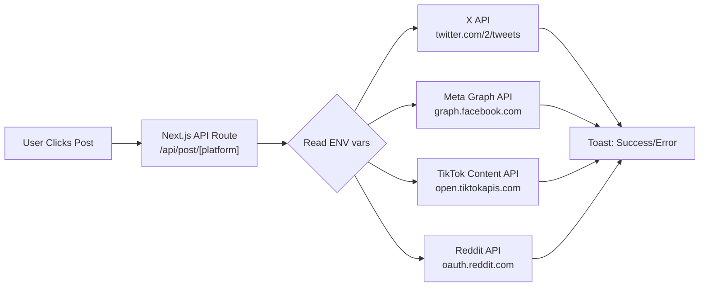

# Social Media API Authentication Guide

A step-by-step guide to obtaining credentials for each platform. All keys go into a `.env.local` file at the root of your Next.js project.

---

## 🐦 X (Twitter) — OAuth 2.0

Twitter uses **OAuth 2.0 with PKCE** for posting on behalf of users, or **App-Only Bearer Token** for read-only access.

### Steps

1. Go to the [Twitter Developer Portal](https://developer.twitter.com/en/portal/dashboard)
2. Click **"Sign up for Free Account"** (or log in if you have one)
3. Fill in the required app use-case description (be honest — say you're building a scheduling tool)
4. Once approved, click **"Create Project"** → then **"Create App"** inside the project
5. Under your app's **"Keys and Tokens"** tab, find:

| Credential | Where to find it |
|---|---|
| `API Key` | "Consumer Keys" section |
| `API Secret` | "Consumer Keys" section |
| `Bearer Token` | "Authentication Tokens" section |
| `Access Token` | "Authentication Tokens" → Generate |
| `Access Token Secret` | "Authentication Tokens" → Generate |

6. Under **"User Authentication Settings"**, enable **OAuth 2.0**, set:
   - Callback URL: `http://localhost:3000/api/auth/callback/twitter`
   - Website URL: your app's URL

### `.env.local` variables

```bash
TWITTER_API_KEY=your_api_key
TWITTER_API_SECRET=your_api_secret
TWITTER_BEARER_TOKEN=your_bearer_token
TWITTER_ACCESS_TOKEN=your_access_token
TWITTER_ACCESS_TOKEN_SECRET=your_access_token_secret
```

### Notes
- **Free tier** allows 1,500 tweets/month. Posting (write access) requires at least the **Basic tier ($100/month)** for production apps.
- For development/testing with your own account, the free tier + your generated Access Token is sufficient.

---

## 📘 Facebook — Meta Graph API

Facebook and Instagram are managed from the same **Meta for Developers** portal.

### Steps

1. Go to [Meta for Developers](https://developers.facebook.com/)
2. Click **"My Apps"** → **"Create App"**
3. Choose **"Other"** as use case → Select **"Business"** type
4. Give your app a name and click **"Create App"**
5. In the left sidebar, click **"Add Product"** → Add **"Facebook Login"**
6. Go to **Settings → Basic**:
   - Copy your **App ID** and **App Secret**
7. Go to **Tools → Graph API Explorer**:
   - Select your App
   - Click **"Generate Access Token"** → select permissions:
     - `pages_manage_posts`
     - `pages_read_engagement`
     - `publish_to_groups` (if needed)
   - Copy the **User Access Token** (this expires — for production you'll need a **Page Access Token** via OAuth flow)

8. To get a **Page Access Token** (long-lived, for your Page):
   ```
   GET https://graph.facebook.com/me/accounts?access_token=USER_ACCESS_TOKEN
   ```
   This returns a list of Pages you manage and their permanent Page Access Tokens.

### `.env.local` variables

```bash
FACEBOOK_APP_ID=your_app_id
FACEBOOK_APP_SECRET=your_app_secret
FACEBOOK_PAGE_ID=your_page_id
FACEBOOK_PAGE_ACCESS_TOKEN=your_page_access_token
```

### Notes
- For posting to a **Facebook Page** (not personal profile), you need the Page Access Token.
- Personal profile posting is **not allowed** by Meta's API policies.

---

## 📸 Instagram — Meta Graph API

Instagram Business/Creator accounts are accessed through the same Meta app.

### Steps

1. Your Instagram account **must** be a **Business or Creator account** (not personal)
2. It **must be linked** to a Facebook Page
3. In the Graph API Explorer, generate a token with permissions:
   - `instagram_basic`
   - `instagram_content_publish`
   - `pages_read_engagement`
4. Get your **Instagram Business Account ID**:
   ```
   GET https://graph.facebook.com/me/accounts?access_token=YOUR_TOKEN
   ```
   Then:
   ```
   GET https://graph.facebook.com/{page-id}?fields=instagram_business_account&access_token=TOKEN
   ```

### `.env.local` variables

```bash
INSTAGRAM_BUSINESS_ACCOUNT_ID=your_ig_business_account_id
# Shares the same Page Access Token as Facebook
INSTAGRAM_ACCESS_TOKEN=your_page_access_token
```

### Notes
- Instagram only allows posting **images and videos**, not plain text.
- Publishing is a **2-step process**: first create a container, then publish it.

---

## 🎵 TikTok — Content Posting API

TikTok has a separate developer program called **TikTok for Developers**.

### Steps

1. Go to [TikTok for Developers](https://developers.tiktok.com/)
2. Log in and click **"Manage Apps"** → **"Create App"**
3. Fill in your app details (category: "Social", platform: "Web")
4. Once created, go to your app → **"Products"** → Add **"Content Posting API"**
5. Apply for the **"Video Upload"** capability (may require review)
6. Under **"App credentials"**, find:
   - **Client Key** (= App ID)
   - **Client Secret**
7. Set up your redirect URI: `http://localhost:3000/api/auth/callback/tiktok`
8. Use OAuth 2.0 flow to get a User Access Token with scope: `video.upload`

### `.env.local` variables

```bash
TIKTOK_CLIENT_KEY=your_client_key
TIKTOK_CLIENT_SECRET=your_client_secret
TIKTOK_ACCESS_TOKEN=your_user_access_token
```

### Notes
- TikTok currently **only allows video uploads** via the Content Posting API.
- Access token expires in **24 hours** — you'll need refresh token logic for production.
- The Content Posting API is **gated** — new apps require approval.

---

## 🟠 Reddit — OAuth 2.0

Reddit uses standard OAuth 2.0 and has a generous free tier.

### Steps

1. Go to [Reddit App Preferences](https://www.reddit.com/prefs/apps)
2. Scroll down and click **"Create Another App..."**
3. Fill in:
   - **Name**: Your app name
   - **Type**: Choose **"web app"**
   - **Redirect URI**: `http://localhost:3000/api/auth/callback/reddit`
   - **About URL**: your app URL (can be localhost for now)
4. Click **"Create App"**
5. You'll see:
   - **Client ID**: The string under the app name (below "web app")
   - **Client Secret**: Listed as "secret"

6. To get a User Access Token, use the OAuth flow with scopes:
   - `submit` — to post
   - `identity` — to identify the user
   - `read` — to read content

### `.env.local` variables

```bash
REDDIT_CLIENT_ID=your_client_id
REDDIT_CLIENT_SECRET=your_client_secret
REDDIT_ACCESS_TOKEN=your_user_access_token
REDDIT_REFRESH_TOKEN=your_refresh_token
REDDIT_USERNAME=your_reddit_username
```

### Notes
- Reddit API is **free** and very developer-friendly.
- Access token expires in **1 hour** — the refresh token is used to get new ones.
- For posting, you need the target **subreddit name** (e.g., `r/technology`).

---

## 📁 Final `.env.local` Template

```bash
# ── X (Twitter) ──────────────────────────────────
TWITTER_API_KEY=
TWITTER_API_SECRET=
TWITTER_BEARER_TOKEN=
TWITTER_ACCESS_TOKEN=
TWITTER_ACCESS_TOKEN_SECRET=

# ── Facebook ──────────────────────────────────────
FACEBOOK_APP_ID=
FACEBOOK_APP_SECRET=
FACEBOOK_PAGE_ID=
FACEBOOK_PAGE_ACCESS_TOKEN=

# ── Instagram ──────────────────────────────────────
INSTAGRAM_BUSINESS_ACCOUNT_ID=
INSTAGRAM_ACCESS_TOKEN=

# ── TikTok ────────────────────────────────────────
TIKTOK_CLIENT_KEY=
TIKTOK_CLIENT_SECRET=
TIKTOK_ACCESS_TOKEN=

# ── Reddit ────────────────────────────────────────
REDDIT_CLIENT_ID=
REDDIT_CLIENT_SECRET=
REDDIT_ACCESS_TOKEN=
REDDIT_REFRESH_TOKEN=
REDDIT_USERNAME=
```

> [!CAUTION]
> **NEVER commit `.env.local` to Git.** Make sure `.env.local` is in your `.gitignore`. Exposed API keys can be abused and your developer accounts could be suspended.

---

## How It All Connects to Your App



In the app I'll build, the API routes read from `process.env.PLATFORM_TOKEN`. When you have real credentials, you just fill in the `.env.local` file and the mocked calls get replaced with real ones.
